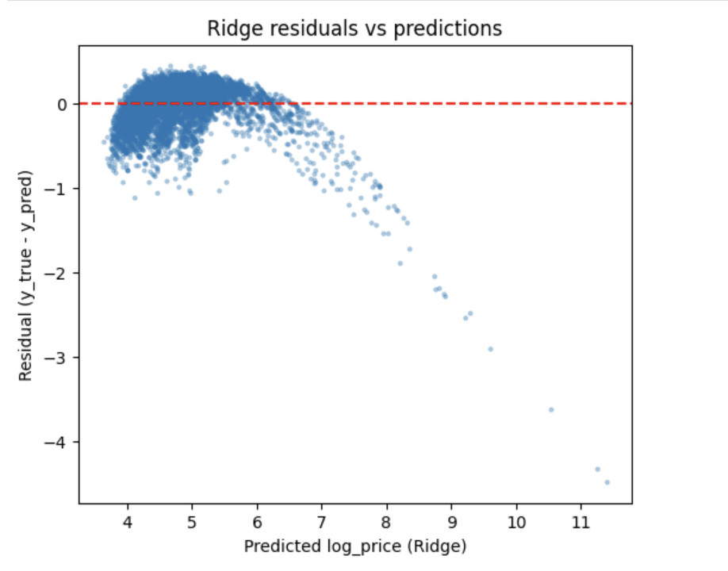
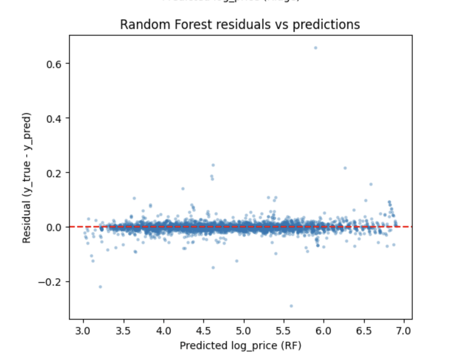
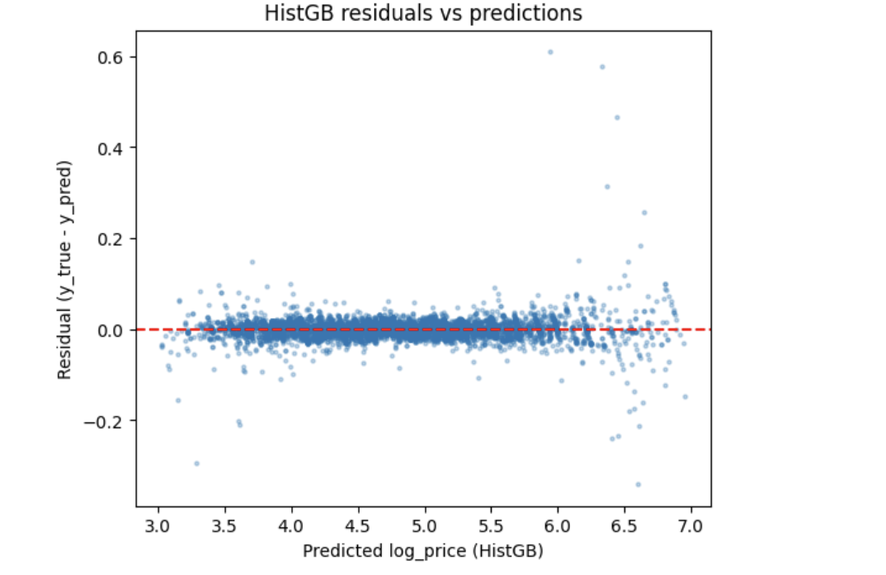
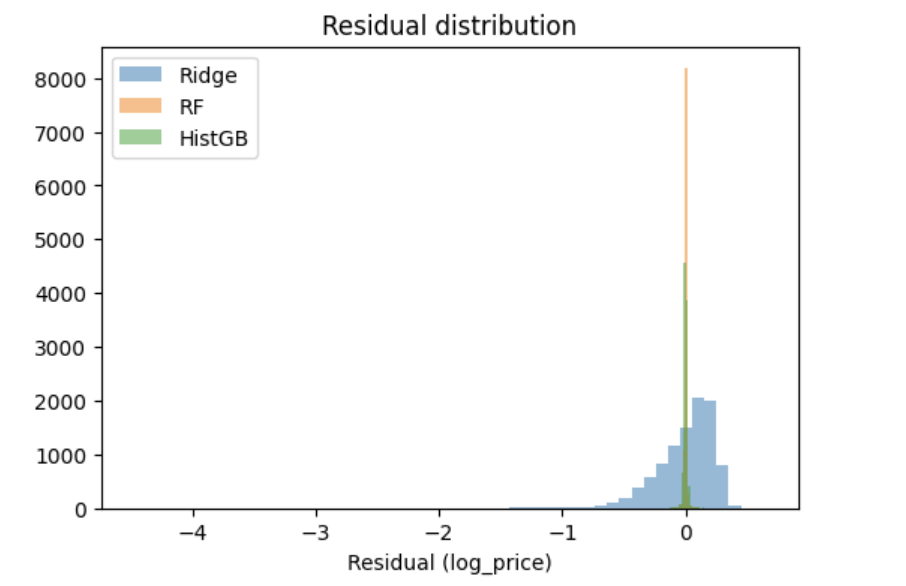

# NYC Airbnb Price Prediction 🗽🏠


## 1. Project Overview
This project predicts nightly Airbnb prices in New York City using tabular listing data. The goal is to understand which factors drive price (location, reviews, availability, etc.) and to build a model that can estimate a fair price for a new listing.

The project follows a standard end-to-end data science lifecycle:
* **Week 1:** Data loading, cleaning, and parquet conversion.
* **Week 2:** Feature engineering (creating 23 custom features).
* **Week 3:** Baseline and tree-based modeling.
* **Week 4:** Evaluation, residual diagnostics, and error analysis.

---

## 2. Dataset
* **Source:** NYC Airbnb Open Data (Listings, Calendar, Reviews).
* **Size:** ~48k listings (post-cleaning).
* **Target:** `log_price` (Log-transformed nightly price).
* **Granularity:** One row per listing.

The data is treated as a cross-sectional snapshot of the NYC market. Raw data is stored in `data/raw/` and processed files in `data/processed/`.

---

## 3. Feature Engineering
I engineered **23 features** to capture local market context, demand, and constraints. Key feature groups include:

| Category | Features |
| :--- | :--- |
| **Location** | `latitude`, `longitude`, neighbourhood groups. |
| **Price Context** | `neigh_price_mean`, `neigh_price_median` (The average price of the surrounding area). |
| **Relative Pricing** | `price_premium_vs_neigh` (Is this listing a budget or luxury option compared to its neighbors?). |
| **Demand/Host** | `reviews_per_month`, `availability_365`, `host_listing_count`. |
| **Constraints** | `minimum_nights`, `min_nights_log`. |

**Note:** The target variable `price` was log-transformed (`log_price`) to stabilize variance and improve linear model performance.

---

## 4. Models & Methodology
I trained three models using an **80/20 train-test split** and median imputation for missing values.

1.  **Ridge Regression (Baseline):** A linear model in log space. Interpretable but struggles with non-linear price drivers (e.g., luxury listings).
2.  **HistGradientBoostingRegressor (HistGB):** Gradient-boosted trees. Handles missing values natively and captures non-linear interactions (e.g., how neighborhood price affects room type).
3.  **RandomForestRegressor (RF):** Used as an **optimistic upper bound**. It achieved near-perfect metrics, suggesting likely overfitting or leakage, so it was excluded from final selection in favor of HistGB.

---

## 5. Evaluation Results
Metrics were calculated on the **held-out test set**.

| Model | RMSE (log) | $R^2$ (log) | RMSE ($) | MAE ($) | Interpretation |
| :--- | :--- | :--- | :--- | :--- | :--- |
| **Ridge** | 0.250 | 0.859 | 1257.1 | 58.1 | Good baseline, but fails on high-end listings. |
| **HistGB** | **0.020** | **0.999** | **10.0** | **2.1** | **Best Model.** Captures non-linearities with minimal error. |
| *RF* | *0.013* | *1.000* | *5.2* | *0.9* | *Likely Overfit / Leakage (Upper Bound only).* |

### Key Insights
* **Neighborhood Context is King:** Features like `price_premium_vs_neigh` and `neigh_price_mean` were the most important drivers.
* **Non-Linearity Matters:** The massive jump in accuracy from Ridge to HistGB shows that pricing is not a simple linear function of features.
* **Luxury Outliers:** Linear models struggle to predict prices for rare, expensive properties (e.g., $5k/night penthouses), whereas tree-based models handled them significantly better.

---

## 6. Repository Structure
```text
airbnb-price-prediction-nyc/
├── data/
│   ├── raw/                  # Original CSVs (ignored by git)
│   └── processed/            # Parquet files (nyc_clean, features)
├── notebooks/
│   ├── 01_eda.ipynb                 # Data exploration & cleaning
│   ├── 02_feature_engineering.ipynb # Creating the 23 features
│   ├── 03_modeling.ipynb            # Training Ridge, RF, HistGB
│   └── 04_evaluation.ipynb          # Residual plots & error analysis
├── src/                      # Helper modules
├── models/                   # Saved model artifacts
├── requirements.txt
└── README.md
```

### Residual plots

Ridge residuals vs predictions:



Random Forest residuals vs predictions:



HistGB residuals vs predictions:



Combined residual distribution:




## 7. How to Run

Clone the repository and install dependencies:
# Clone the repo
git clone https://github.com/durvishpaliwal/airbnb-price-prediction-nyc.git

cd airbnb-price-prediction-nyc

# Create virtual environment
python -m venv venv
source venv/bin/activate  # Windows: venv\Scripts\activate

# Install requirements
pip install -r requirements.txt
Run the notebooks in order:

Launch Jupyter: jupyter notebook

Start with 01_eda.ipynb to generate the cleaned data.

Proceed through feature engineering, modeling, and evaluation.
